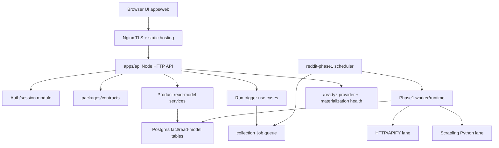

# Product Shell 开发框架

状态：已被最终设计取代。后续开发以 `docs/product-shell-final-design-2026-04-20.md` 为准；本文保留为设计草案和推导记录。

日期：2026-04-20

## 范围

本文只覆盖 `P1.7` 之后的产品壳开发：

- 交互系统：面向浏览器的 analytics UI。
- 登录系统：账号密码登录，带邀请码/审核限制，避免完全公开使用。
- 部署框架：一台低成本海外 Linux 服务器 + 公开域名。

现有 Reddit analytics engine、算法读模型、provider-routing、Scrapling promotion 作为已验证基线冻结。除非修复回归，或 product-shell 切片明确需要窄范围 API 合同调整，否则不改算法/采集主线。

## 已核对的当前状态

- 注：以下“当前状态”条目已转为历史草案快照；真实当前阶段以 `Projects/project.md` 为准。
- `Projects/project.md` 当前阶段已推进到 `public-launch-hardening`，前端 product shell 已完成。
- 当前本地已有 `apps/api` 和 `apps/web`。
- `apps/api/src/server.ts` 启动时强制要求 `API_BEARER_TOKEN`。
- `apps/api/src/create-api-server.ts` 默认保护 `/v1/`，当前 `/healthz` 和 `/readyz` 是独立健康检查路由。
- `packages/contracts/src/http.ts` 是前后端可复用的 HTTP 合同边界。
- PostgreSQL migration 由 `src/storage/schema/run-migrations.ts` 执行，schema 当前到 `018_auth_core.sql`。
- runtime 当前有两条采集 lane：TypeScript HTTP/APIFY lane 和 Python Scrapling lane。
- HTTP connector 在 Windows `win32` + `auto` transport 下有 PowerShell fallback；Linux 上线不能假设这条本地兜底链路仍然存在，必须单独验证 Linux 下 `fetch` 或 Scrapling。

## 架构图



边界规则：

- `apps/web` 只消费产品 API，不接触 bearer token，也不接触 worker/runtime。
- `apps/api` 负责 request parsing、auth、role guard、response shaping。
- `src/application` 负责 use case 和 read-model assembly。
- `src/runtime` 仍然只做 composition root：env、repository bundle、connector factory。
- `workers` 继续负责 collection/materialization。
- `connectors` 只处理 source transport，不放产品登录或排名策略。

## 开发框架

### Lane 1：先做部署硬化

目标：先让现有 engine 可以稳定以生产形态跑在一台 Linux 服务器上，再叠加用户可见功能。

交付物：

- 增加 production build 路径，输出 JS 到 `dist/`。
- 本地开发继续可以用 `tsx`，生产只用 `node dist/...`。
- 拆分服务器环境文件：
  - `.env.api`
  - `.env.scheduler`
  - 可选 `.env.keyword-refresh`
- 增加 systemd 模板：
  - `reddit-api.service`
  - `reddit-phase1-scheduler.service`
  - 可选 `reddit-keyword-refresh.service`
- 增加 Nginx 路由方案：
  - `/` 服务 `apps/web/dist`
  - `/api/` 反代 API
  - `/healthz` 和 `/readyz` 上线前必须限制来源，或移动到 ops 权限路由后面
- 固化服务器 release 目录：

```text
/srv/reddit-monitoring-mvp/
  releases/<git-sha>/
  current -> releases/<git-sha>
  shared/
    .env.api
    .env.scheduler
    backups/
    logs/
```

验证门槛：

- `npm run typecheck`
- `npm run db:migrate` 能在 staging/local Postgres 跑通
- API 能从 compiled JS 启动
- scheduler 能从 compiled JS 启动
- `/healthz` 和 `/readyz` 能通过 Nginx 访问
- Linux 模式下至少一次 provider smoke check 成功：`REDDIT_HTTP_TRANSPORT=fetch` 或 `REDDIT_LIVE_PROVIDER=scrapling`

### Lane 2：Auth/Session 模块

目标：新增产品用户体系，但不复用现有 Reddit source `Account` 实体，也不删除已有 bearer-token 机器入口。

推荐模型：

- 浏览器用户认证：Postgres-backed session cookie。
- 脚本/内部认证：继续使用现有 `API_BEARER_TOKEN`。
- 注册限制：邀请码 + 审核状态。
- 默认公开策略：不做完全开放注册。

新增表：

```text
app_user
  id uuid primary key
  email text unique not null
  display_name text
  role text not null check role in ('owner','admin','viewer')
  status text not null check status in ('pending','active','disabled')
  created_at timestamptz not null
  updated_at timestamptz not null

app_user_password
  user_id uuid primary key references app_user(id)
  password_hash text not null
  password_algo text not null
  updated_at timestamptz not null

app_invite
  id uuid primary key
  code_hash text unique not null
  status text not null check status in ('active','disabled')
  role_on_accept text not null
  max_uses integer not null
  used_count integer not null
  expires_at timestamptz
  created_at timestamptz not null

app_session
  id uuid primary key
  user_id uuid not null references app_user(id)
  token_hash text unique not null
  expires_at timestamptz not null
  last_seen_at timestamptz not null
  created_at timestamptz not null

app_audit_log
  id uuid primary key
  actor_user_id uuid references app_user(id)
  action text not null
  resource_type text
  resource_id text
  meta_json jsonb not null default '{}'
  created_at timestamptz not null
```

密码/session 规则：

- 密码 hash：Node `crypto.scrypt`。
- session token：随机 bytes，只保存 SHA-256 hash。
- Cookie：`HttpOnly`、`Secure`、`SameSite=Lax`、服务端控制过期。
- 不要用 `stableUuidFromString` 生成 auth ID、token 或任何安全标识；安全标识必须随机。

接口：

| Route | Auth | Purpose |
| --- | --- | --- |
| `POST /auth/register` | invite code | 创建 `pending` 用户；只有明确配置时才直接 `active` |
| `POST /auth/login` | public | 校验密码和 active 状态，创建 session |
| `POST /auth/logout` | session | 注销当前 session |
| `POST /auth/logout-all` | session | 注销该用户所有 session |
| `GET /auth/me` | session | 返回当前用户和 role |
| `POST /auth/change-password` | session | 修改密码并回收旧 session |

保护规则：

- `/auth/*`：按具体 route 决定 public/session。
- `/v1/*`：允许有效 session 或有效 bearer token。
- `/v1/runs/reddit-phase1` 这类 ops 写接口：session 必须是 `admin|owner`，脚本仍可用 bearer。
- 未来如果增加 `/internal/*`：只允许 bearer。

验证门槛：

- password hash、token hash、invite 校验、session 过期的 unit tests。
- auth repository tests。
- API integration tests：register/login/logout/me，以及 `/v1/*` 的 session-or-bearer 访问。
- 现有 `tests/integration/api-server-access.test.ts` 的 bearer 行为必须继续通过。

### Lane 3：浏览器交互系统

目标：围绕现有 read models 做最小可用的 analytics 产品 UI。

推荐栈：

- `apps/web`
- Vite + React + TypeScript
- TanStack Query 做 API cache/retry
- ECharts 做趋势图
- 从 `packages/contracts` 复用类型

第一版页面：

- `/login`
- `/dashboard`：market trend summary、readiness 简态、recent anomalies/incidents。
- `/targets/:subreddit`：daily heat、driver posts、anomaly feed、keyword context。
- `/queries`：创建 keyword query、查看 query daily trend。
- `/ops`：run trigger、readiness、provider/materialization 状态；仅 `admin|owner` 可见。

交互规则：

- 长任务先用提交后轮询，不上 WebSocket/SSE。
- 浏览器端不保存、不展示、不传递 bearer token。
- `/readyz` 细节属于 ops 数据；普通 product UI 只展示简化状态。

验证门槛：

- 浏览器登录能打通本地 API。
- session cookie 能被设置，并能访问 `/auth/me`。
- dashboard 能读取现有 `/v1/trends/market`。
- target 页面能读取现有 subreddit trend/daily/drivers/anomaly endpoints。
- ops 页面只有 `admin|owner` 可以触发 run。

## 实施顺序

1. 部署硬化：build 输出、env profile、systemd/Nginx 模板、Linux provider smoke command。
2. Auth data layer：migration、domain entities、repository interfaces、Postgres repositories，必要时补 in-memory test repository。
3. Auth use cases + API routes：register/login/logout/me、`/v1/*` session-or-bearer guard。
4. Frontend shell：新增 `apps/web`，先做 login + dashboard。
5. Product pages：target detail、keyword query、ops page。
6. Public launch hardening：按用户/session 限流、限制 readiness 细节、backup、log rotation、rollback runbook。

## 风险清单

| Risk | Level | Why | Mitigation |
| --- | --- | --- | --- |
| Linux 采集表现不同于 Windows | High | PowerShell fallback 只在 Windows 生效 | 上线前验证 Linux `fetch` 和 Scrapling |
| 登录用户误复用 Reddit `Account` | High | 现有 `Account` 是 source account，不是产品用户 | 使用 `app_user` 命名和独立 auth repository |
| 公开域名暴露 ops 写接口 | High | `/v1/runs/reddit-phase1` 可以触发任务 | session role guard；必要时拆 bearer-only internal route |
| 生产继续跑 `tsx` | Medium | 启动、内存和运维行为不够生产化 | 编译成 JS，用 systemd 跑 `node dist/...` |
| 先做大前端导致上线链路不稳 | Medium | UI 会依赖未固化的 auth/deploy | deploy/auth 先行，再做 UI |
| Scrapling dynamic 缺浏览器依赖 | Medium | dynamic/stealth profile 需要 Python/browser runtime | 明确 Linux install 和 smoke verify |

## 第一条垂直切片

下一步建议直接做：

```text
auth/session minimal core
  -> migration 018_auth_core.sql
  -> auth entities + repositories
  -> login/logout/me routes
  -> /v1/* accepts session or bearer
  -> tests for bearer compatibility and session access
```

如果 invite registration 让切片变大，就先完成 `login/session`，把 `register/invite` 作为第二个切片。
