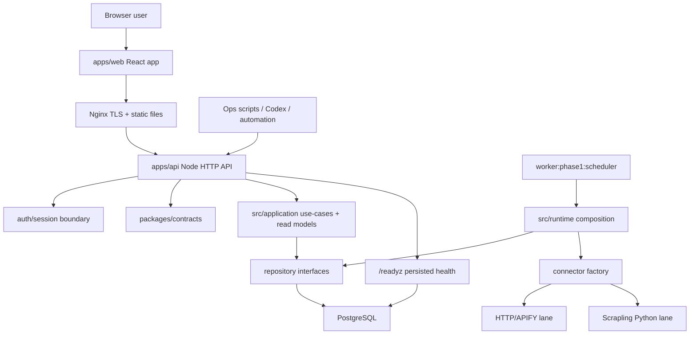
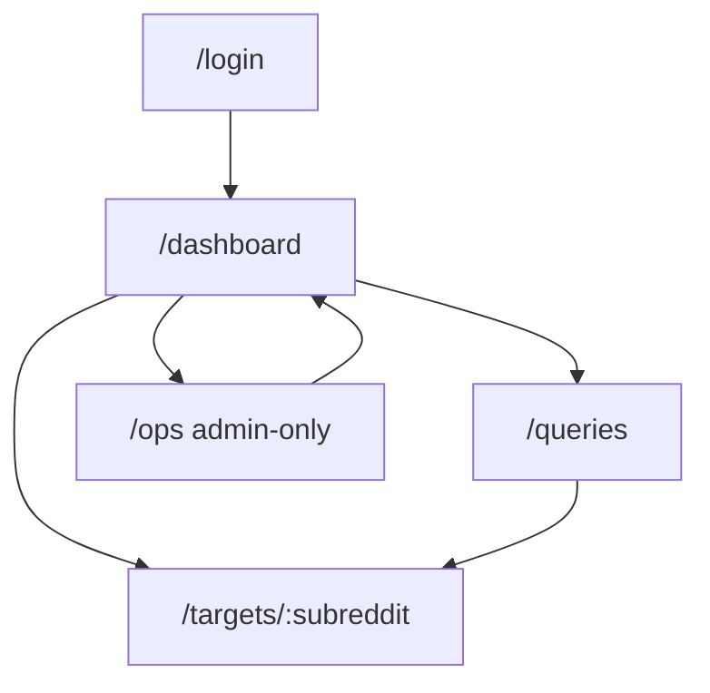

# Post-P1.7 Product Shell 最终设计

日期：2026-04-20
状态：后续开发指导源
适用范围：`E:\vibe coding\project`

## 0. 结论

当前仓库不需要重做核心架构。最终设计是：

- 保留现有 Reddit analytics engine、P1.7 算法读模型、provider-routing、Scrapling 观测与验证路径。
- 在现有模块化单体上新增 product shell：`auth/session`、`apps/web`、Linux 单机部署硬化。
- 登录系统采用 Postgres session cookie，不采用 JWT 作为第一版主路径。
- 注册采用邀请码 + 审核/状态控制，不做完全开放注册。
- 浏览器用户走 session；脚本、运维、自动化继续走现有 `API_BEARER_TOKEN`。
- 前端新建 `apps/web`，只消费 `apps/api` 产品 API，不接触 worker/runtime/connector。
- 上线采用一台 Linux 服务器上的 Nginx + API service + scheduler service + PostgreSQL；暂不拆微服务，不上 Redis，不上 Kubernetes。

第一条开发切片：

```text
auth/session core
  -> 018_auth_core.sql
  -> auth entities + repository interfaces
  -> Postgres auth repositories + test/in-memory repositories
  -> auth service/use cases
  -> /auth/login /auth/logout /auth/me
  -> /v1/* accepts session or bearer
  -> role guard for ops write routes
  -> focused tests
```

邀请码注册可以并入第一切片；如果实现变大，就拆成第二切片。

## 1. 设计证据

本设计基于以下本地文件核对，不依赖猜测：

| 结论 | 本地证据 |
| --- | --- |
| 当前阶段是 `P1.7-complete`，主线转向 product shell | `obsidian-reddit专用/Projects/project.md` frontmatter 与最新 activity |
| API 当前启动依赖 `API_BEARER_TOKEN` | `apps/api/src/server.ts` |
| API 当前用 `protectedPathPrefixes` 默认保护 `/v1/` | `apps/api/src/create-api-server.ts` |
| `/healthz`、`/readyz` 已存在 | `apps/api/src/create-api-server.ts` |
| `/v1/runs/reddit-phase1` 是可触发任务的 ops 写接口 | `apps/api/src/create-api-server.ts` |
| shared contract 已在 `packages/contracts/src/http.ts` | `packages/contracts/src/http.ts` |
| 当前没有 `apps/web` | `apps/` 目录扫描 |
| schema 当前到 `017_provider_health_scrapling_observability.sql` | `src/storage/schema/` |
| Postgres repository bundle 已集中装配 | `src/storage/repositories/postgres/postgres-repository-bundle.ts` |
| Linux 上不能依赖 Windows PowerShell fallback | `src/connectors/reddit/reddit-http.connector.ts` 的 `platform === "win32"` fallback |
| Scrapling 已是 runtime/provider-policy/readyz 观测路径的一部分 | `src/connectors/reddit/reddit-scrapling.connector.ts`、`src/runtime/reddit-provider-routing-policy.ts`、`apps/api/src/readyz-observability.ts` |
| 现有 API access 测试覆盖 bearer/CORS/rate-limit | `tests/integration/api-server-access.test.ts` |

## 2. 总体架构



最终边界：

- `apps/web`：UI、路由、表单、图表、session 登录状态；不放 bearer token，不直接调用 Reddit，不触发 worker 内部函数。
- `apps/api`：HTTP request parsing、auth/session guard、role guard、response shaping、CORS/rate-limit。
- `src/application`：业务 use case、auth use case、product read-model assembly、run dispatch。
- `src/domain`：实体、值对象、repository 接口、角色/status 枚举。
- `src/storage`：schema、Postgres repositories、in-memory test repositories。
- `src/runtime`：env parsing、Postgres bundle、connector factory、phase1 runtime composition；不放产品登录策略。
- `workers`：采集和物化任务；不感知浏览器用户。
- `connectors/reddit`：Reddit transport、pagination、Scrapling bridge；不放产品 ranking/auth。

## 3. 不做什么

第一版明确不做：

- 不把产品用户塞进现有 `Account` / `accountRepository`。
- 不删除 `API_BEARER_TOKEN`。
- 不开放无门槛注册。
- 不先做 OAuth / Google 登录。
- 不引入 Redis 作为 session store。
- 不把 API 改成 Express/Nest。
- 不拆微服务。
- 不上 Kubernetes。
- 不让前端直接持有 bearer token。
- 不让 product-shell 开发改动 P1.7 算法公式、provider-policy 阈值、Scrapling promotion 逻辑。

## 4. Auth/Session 最终设计

### 4.1 认证模型

两类认证同时存在：

| 入口 | 认证方式 | 用途 |
| --- | --- | --- |
| 浏览器用户 | Postgres-backed session cookie | 产品 UI、普通查询、admin ops |
| 脚本/自动化 | `Authorization: Bearer <API_BEARER_TOKEN>` | Codex、本地脚本、运维、部署验证 |

session 优先使用 cookie，因为单机部署下服务端 session 更容易撤销、封禁、审计和强制下线。

### 4.2 角色与状态

角色：

| Role | 权限 |
| --- | --- |
| `owner` | 用户管理、邀请码管理、ops、只读/写全部产品功能 |
| `admin` | 触发采集 run、管理 target、查看 ops、使用产品查询 |
| `viewer` | 只读 dashboard、target、query |

状态：

| Status | 含义 |
| --- | --- |
| `pending` | 已注册但未审核，不允许登录产品 API |
| `active` | 可登录和使用 |
| `disabled` | 禁用，所有 session 应失效或被拒绝 |

### 4.3 数据表

新增 migration：`src/storage/schema/018_auth_core.sql`。

```sql
CREATE TABLE app_user (
  id UUID PRIMARY KEY,
  email TEXT NOT NULL UNIQUE,
  display_name TEXT,
  role TEXT NOT NULL CHECK (role IN ('owner', 'admin', 'viewer')),
  status TEXT NOT NULL CHECK (status IN ('pending', 'active', 'disabled')),
  created_at TIMESTAMPTZ NOT NULL DEFAULT NOW(),
  updated_at TIMESTAMPTZ NOT NULL DEFAULT NOW()
);

CREATE TABLE app_user_password (
  user_id UUID PRIMARY KEY REFERENCES app_user(id) ON DELETE CASCADE,
  password_hash TEXT NOT NULL,
  password_algo TEXT NOT NULL,
  updated_at TIMESTAMPTZ NOT NULL DEFAULT NOW()
);

CREATE TABLE app_invite (
  id UUID PRIMARY KEY,
  code_hash TEXT NOT NULL UNIQUE,
  status TEXT NOT NULL CHECK (status IN ('active', 'disabled')),
  role_on_accept TEXT NOT NULL CHECK (role_on_accept IN ('owner', 'admin', 'viewer')),
  max_uses INTEGER NOT NULL CHECK (max_uses > 0),
  used_count INTEGER NOT NULL DEFAULT 0 CHECK (used_count >= 0),
  expires_at TIMESTAMPTZ,
  created_at TIMESTAMPTZ NOT NULL DEFAULT NOW()
);

CREATE TABLE app_session (
  id UUID PRIMARY KEY,
  user_id UUID NOT NULL REFERENCES app_user(id) ON DELETE CASCADE,
  token_hash TEXT NOT NULL UNIQUE,
  expires_at TIMESTAMPTZ NOT NULL,
  last_seen_at TIMESTAMPTZ NOT NULL DEFAULT NOW(),
  created_at TIMESTAMPTZ NOT NULL DEFAULT NOW()
);

CREATE TABLE app_audit_log (
  id UUID PRIMARY KEY,
  actor_user_id UUID REFERENCES app_user(id) ON DELETE SET NULL,
  action TEXT NOT NULL,
  resource_type TEXT,
  resource_id TEXT,
  meta_json JSONB NOT NULL DEFAULT '{}'::jsonb,
  created_at TIMESTAMPTZ NOT NULL DEFAULT NOW()
);

CREATE INDEX app_session_user_id_idx ON app_session(user_id);
CREATE INDEX app_session_expires_at_idx ON app_session(expires_at);
CREATE INDEX app_audit_log_created_at_idx ON app_audit_log(created_at);
```

实现时可按现有 SQL 风格调整换行和 index 命名，但不要改已应用的历史 migration。

### 4.4 安全规则

- `app_user.id`、`app_session.id`、`app_invite.id` 用随机 UUID，不用 `stableUuidFromString`。
- session token 用强随机 bytes，只保存 SHA-256 hash。
- password hash 第一版使用 Node `crypto.scrypt`。
- cookie 名建议：`rm_session`。
- cookie 属性：
  - `HttpOnly`
  - `Secure` 在生产必须开启
  - `SameSite=Lax`
  - `Path=/`
  - `Max-Age` 与 `app_session.expires_at` 对齐
- 登录失败返回统一错误，不泄露邮箱是否存在。
- `pending`、`disabled` 用户不可创建新 session。
- `disabled` 用户已有 session 在 request guard 中也必须拒绝。
- logout 删除当前 session；logout-all 删除该用户全部 session。
- change-password 成功后建议回收旧 session，只保留当前 session 或要求重新登录。

### 4.5 Auth 模块文件布局

新增文件建议：

```text
src/domain/entities/app-user.ts
src/domain/entities/app-invite.ts
src/domain/entities/app-session.ts
src/domain/repositories/app-user-repository.ts
src/domain/repositories/app-invite-repository.ts
src/domain/repositories/app-session-repository.ts
src/application/services/password-hashing.service.ts
src/application/services/session-token.service.ts
src/application/use-cases/register-app-user.use-case.ts
src/application/use-cases/login-app-user.use-case.ts
src/application/use-cases/logout-app-user.use-case.ts
src/application/use-cases/get-current-app-user.use-case.ts
src/storage/repositories/postgres/postgres-app-user.repository.ts
src/storage/repositories/postgres/postgres-app-invite.repository.ts
src/storage/repositories/postgres/postgres-app-session.repository.ts
```

API 层建议新增或拆分：

```text
apps/api/src/auth-http.ts
apps/api/src/auth-cookie.ts
apps/api/src/auth-guard.ts
```

如果为了最小改动，第一切片可以先把 route 接入 `create-api-server.ts`，但 auth 解析和 guard 逻辑要尽快拆到小文件，避免继续膨胀这个大文件。

## 5. API 最终设计

### 5.1 路由分区

| 路由 | 认证 | 说明 |
| --- | --- | --- |
| `GET /healthz` | public 或 Nginx allowlist | 存活检查，生产不返回敏感细节 |
| `GET /readyz` | owner/admin 或 Nginx allowlist | 详细 readiness，生产不应完全公开 |
| `POST /auth/register` | invite code | 邀请码注册 |
| `POST /auth/login` | public | 登录并设置 cookie |
| `POST /auth/logout` | session | 注销当前 session |
| `POST /auth/logout-all` | session | 注销所有 session |
| `GET /auth/me` | session | 当前用户 |
| `POST /auth/change-password` | session | 修改密码 |
| `/v1/trends/*` | session or bearer | 产品查询 |
| `POST /v1/keyword-queries` | session or bearer | 创建 query，可先允许 viewer |
| `POST /v1/targets/subreddit` | admin/owner session or bearer | target 管理 |
| `POST /v1/runs/reddit-phase1` | admin/owner session or bearer | ops 写接口 |

### 5.2 Session-or-bearer guard

`/v1/*` 的最终判断顺序：

1. 如果 bearer token 有效，视为 machine actor，允许按当前脚本权限执行。
2. 否则读取 session cookie。
3. 查 `app_session.token_hash`，校验未过期。
4. 查用户 status，必须是 `active`。
5. 对 ops 写路由校验 role：`admin|owner`。
6. 失败统一返回 `401 unauthorized` 或 `403 forbidden`。

注意：

- bearer 继续兼容现有测试和脚本。
- rate-limit key 需要从 bearer token 扩展到 session user id；否则浏览器 session 可能退化成 IP 限流。
- CORS 生产环境不能继续宽松 `*`；有公开域名后应设置具体 origin，并允许 cookie credentials。

### 5.3 Contract 更新

`packages/contracts/src/http.ts` 应新增 auth DTO：

```ts
export type AppUserRole = "owner" | "admin" | "viewer";
export type AppUserStatus = "pending" | "active" | "disabled";

export interface AuthUserView {
  id: string;
  email: string;
  displayName?: string;
  role: AppUserRole;
  status: AppUserStatus;
}

export interface AuthMeResponse {
  ok: true;
  requestId: string;
  user: AuthUserView;
}
```

开发时按现有 contract 命名风格落地，不在 API route 内重复定义 response struct。

## 6. 前端最终设计

### 6.1 应用位置

新增 `apps/web`。第一版只做产品壳，不把采集算法 UI 做成复杂后台。

建议结构：

```text
apps/web/
  src/
    app/
    api/
    auth/
    routes/
    components/
    charts/
```

### 6.2 技术选择

- Vite + React + TypeScript。
- TanStack Query 负责请求缓存、加载态、错误态、轮询。
- ECharts 负责趋势图。
- 复用 `packages/contracts` 类型。

这些是最终方向；实际安装依赖时必须以当前 `package.json` 和 npm workspace 形态为准。如果引入 workspace 结构会扩大范围，第一版可以在根项目保持单 package，后续再整理。

### 6.3 页面

第一版页面：

| Route | 用户 | 内容 |
| --- | --- | --- |
| `/login` | public | 登录表单 |
| `/dashboard` | viewer+ | market trend、top movers、recent incidents、简化 readiness |
| `/targets/:subreddit` | viewer+ | daily heat、trend、drivers、anomalies |
| `/queries` | viewer+ | keyword query 创建和结果 |
| `/ops` | admin/owner | readyz 细节、run trigger、provider/materialization 状态 |

交互原则：

- 第一版用轮询，不做 WebSocket/SSE。
- 所有 API request 使用 cookie session，`credentials: include`。
- 401 跳 `/login`。
- 403 展示无权限，不自动重试。
- ops 页默认折叠危险操作，触发 run 前要有明确确认。
- 前端不出现“如何使用系统”的大段说明；用自然 UI 状态表达。

### 6.4 UI 信息架构



## 7. 部署最终设计

### 7.1 单机进程

一台 Linux 服务器上运行：

- `nginx`
- `postgresql`
- `reddit-api.service`
- `reddit-phase1-scheduler.service`
- 可选 `reddit-keyword-refresh.service`

暂不引入 Docker Compose 作为必选路径。原因：当前项目脚本以 `tsx` 为主，还没有 production build/docker 形态；先用 systemd 固化更小。

### 7.2 生产 build

需要新增：

- `npm run build`
- API compiled output
- scheduler compiled output
- keyword refresh compiled output

生产不直接跑 `tsx`。本地开发可以继续使用现有脚本。

### 7.3 目录布局

```text
/srv/reddit-monitoring-mvp/
  releases/
    <git-sha>/
  current -> releases/<git-sha>
  shared/
    .env.api
    .env.scheduler
    backups/
    logs/
```

部署流程：

1. 拉取代码到新 release。
2. `npm ci`。
3. `npm run build`。
4. `npm run db:migrate`。
5. 切换 `current` symlink。
6. 重启 API 和 scheduler。
7. 校验 `/healthz`、`/readyz`。
8. 执行 Linux provider smoke check。

### 7.4 Linux 采集兼容性

上线前必须验证：

- `REDDIT_HTTP_TRANSPORT=fetch` 下 HTTP lane 是否稳定。
- `REDDIT_LIVE_PROVIDER=scrapling` 下 Scrapling lane 是否可执行。
- dynamic/stealth profile 如果启用，Python 环境和浏览器依赖必须可用。
- 不把 Windows PowerShell fallback 当成 Linux 可用能力。

### 7.5 Nginx

最终路由：

```text
/        -> apps/web/dist
/api/    -> 127.0.0.1:<api-port>
/healthz -> 127.0.0.1:<api-port>/healthz, restricted if public
/readyz  -> 127.0.0.1:<api-port>/readyz, restricted or moved behind ops auth
```

生产域名后：

- TLS 必须开启。
- CORS 只允许正式前端 origin。
- cookie `Secure` 必须开启。
- `/readyz` 细节不应裸露给公网。

## 8. 开发顺序

### Phase A：Auth/session core

范围：

- `018_auth_core.sql`
- auth entities/repositories
- Postgres + in-memory/test repositories
- password/session services
- `login/logout/me`
- session-or-bearer guard
- role guard for ops write routes

验收：

- `npm run typecheck`
- auth unit tests
- auth API integration tests
- existing `tests/integration/api-server-access.test.ts`
- targeted `/v1/trends/market` session access test
- targeted `/v1/runs/reddit-phase1` role guard test

### Phase B：Invite/register/admin basics

范围：

- `POST /auth/register`
- invite repository/use case
- owner/admin invite creation can先用脚本或受保护 API，按实现大小选择
- audit log first pass

验收：

- invite code hash 不明文存储
- expired/disabled/used-up invite 被拒绝
- pending user 不可登录
- active user 可登录

### Phase C：Deployment hardening

范围：

- production build
- systemd templates
- Nginx template
- env profiles
- backup/rollback runbook
- Linux provider smoke script

验收：

- compiled API boots
- compiled scheduler boots
- migrations run
- health/readiness pass
- Linux provider smoke pass

### Phase D：Frontend shell

范围：

- `apps/web`
- login
- auth state
- dashboard
- target detail minimal
- query page minimal
- ops page minimal

验收：

- login -> dashboard works
- refresh page keeps session
- 401 redirects login
- viewer cannot see/execute ops
- admin/owner can trigger ops run

### Phase E：Public launch hardening

范围：

- CORS exact origin
- cookie secure config
- rate-limit by session user
- readiness exposure policy
- access logs and audit logs
- deployment checklist

验收：

- public domain smoke test
- invalid origin blocked
- cookie secure in production
- backup restore procedure documented
- rollback procedure documented

## 9. 测试策略

每个切片至少：

- `npm run typecheck`
- 与切片相关 unit tests
- 与 HTTP/API 相关 integration tests

跨 API/auth/ops 的切片必须额外跑：

- `tests/integration/api-server-access.test.ts`
- 新增 auth integration tests

触碰 scheduler/materialization/provider-policy 的切片必须额外跑：

- `npm run algo:phase1`
- 必要时 `npm run algo:promotion:verify`

如果只是文档更新，不需要跑代码测试，但必须检查文档路径和 `project.md` 定位关系。

## 10. 后续 Codex 执行规则

后续开发开始时按这个顺序读：

1. `obsidian-reddit专用/Projects/project.md`
2. `docs/product-shell-final-design-2026-04-20.md`
3. 当前切片涉及的源文件和测试

执行约束：

- 每次只做一个最小完整垂直切片。
- 不创建 `task_plan.md`、`findings.md`、`progress.md`。
- 不改未请求的算法/采集逻辑。
- 不回退工作区已有用户改动。
- 结束时更新 `project.md`：`updated_at`、`next_action`、一条 `Scope/Why now/Verify/Next` activity。
- 大日志放 `docs/`，不要粘进 `project.md`。

## 11. 风险与处理

| 风险 | 级别 | 处理 |
| --- | --- | --- |
| Auth 改动破坏现有 bearer 脚本 | 高 | 先写 bearer compatibility 测试，再改 guard |
| 产品用户和 Reddit source account 混淆 | 高 | 所有产品用户命名用 `app_user` / `AppUser` |
| 公开域名暴露 ops | 高 | role guard + Nginx 限制 `/readyz`，必要时拆 `/internal/*` |
| Linux 采集和 Windows 表现不同 | 高 | 上线前独立 Linux provider smoke |
| `create-api-server.ts` 继续膨胀 | 中 | 第一切片可接入，随后拆 `auth-*` 小文件 |
| session cookie/CORS 配置不匹配 | 中 | 本地和生产分别验证 `credentials`、origin、Secure |
| 前端先行导致后端权限返工 | 中 | 先 auth/session，再 frontend |
| 生产仍跑 `tsx` | 中 | C 阶段强制 compiled JS + systemd |

## 12. 最终验收定义

product shell 第一版完成的定义：

- 有受限注册/登录或已可用 owner seed/admin 创建机制。
- 浏览器用户使用 session cookie 登录。
- `/v1/*` 支持 session 或 bearer。
- ops 写接口只允许 admin/owner session 或 bearer。
- `apps/web` 能完成 login、dashboard、target detail、queries、ops 的最小闭环。
- 单台 Linux 部署有 build、systemd、Nginx、migration、backup、rollback、provider smoke 指南。
- `project.md` 始终指向本最终设计，后续 Codex 可定位当前状态和下一步。
